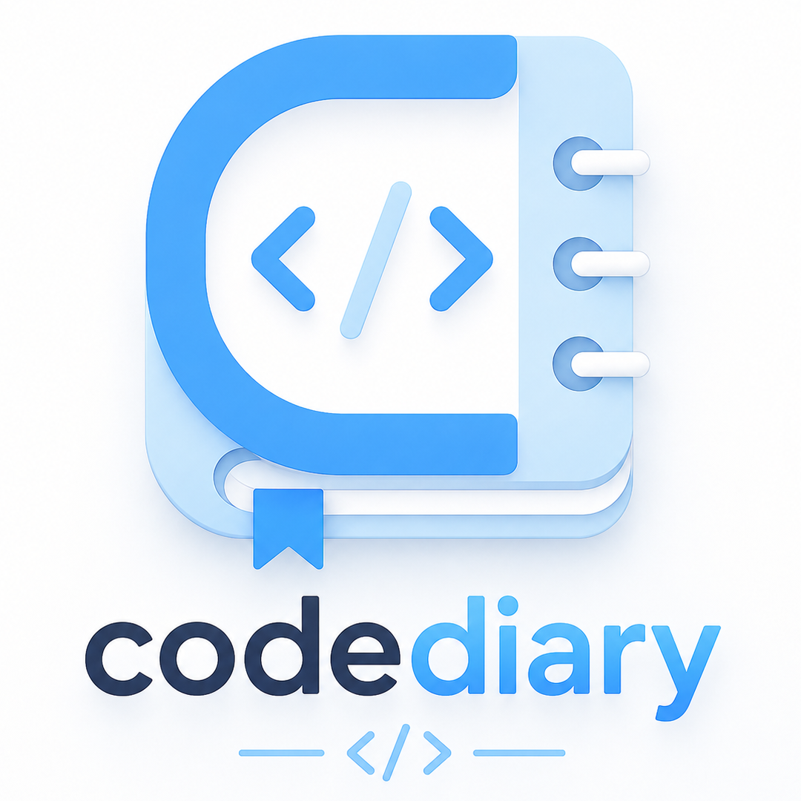

<div align="center">
  

  # Code Diary

  **An All-in-One Fullstack Learning Management Platform & Interactive Code Playground**

  [](https://kodediary.vercel.app)
  [](https://nextjs.org/)
  [](https://react.dev/)
  [](https://tailwindcss.com/)
  [](https://supabase.com/)
  [](LICENSE)

  <br />

  🔗 **Live Application:** [https://kodediary.vercel.app](https://kodediary.vercel.app)

</div>

---

## 📌 Overview

**Code Diary** is a comprehensive learning platform designed for students, developers, and educators. It combines curriculum tracking, multi-language in-browser code execution, interactive problem sets, progress analytics, automated PDF certificate generation, and an instructor portal into a unified web application and PWA.

---

## ✨ Key Features

- 📚 **Curriculum Tracking**: Browse modules categorized by subject (Data Structures, Algorithms, Web Development, SQL), track topic completion, and export study notes.
- 💻 **Monaco Code Editor**: In-browser code playground powered by VS Code's editor engine, supporting multi-language code execution and public snippet sharing (`/share-code/[id]`).
- 📊 **Analytics & Gamification**: Daily consecutive login streak counter, weekly activity breakdowns, and smart topic recommendations.
- 📜 **Automated Certification**: Instant generation of course completion certificates with digital verification IDs and PDF export options.
- 💬 **Student Helpdesk & Code Reviews**: Threaded Q&A ticket system between students and instructors with direct code submission reviews.
- ⚡ **Admin Management Portal**: Complete administrative tools to manage curriculum topics, problem sets, user accounts, and system analytics.
- 🔒 **Security & PWA**: Role-based access control (RBAC), 10-minute email OTP verification, and offline service worker support.

---

## 🛠️ Tech Stack & Tools

| Component | Technology | Description |
| :--- | :--- | :--- |
| **Framework** |  | React framework with App Router |
| **Frontend UI** |   | Dynamic UI components & responsive Tailwind styling |
| **Code Editor** |  | In-browser code editing environment |
| **Database** |  | PostgreSQL relational database & storage |
| **Deployment** |  | Production hosting & edge functions |
| **Export Tools** | `jsPDF` • `SheetJS (XLSX)` | Document exports for study notes, certificates & spreadsheets |
| **Email Service** | `Nodemailer` | SMTP integration for email OTP verification |

---

## 📂 Project Structure

```
coding-tracker/
├── app/                      # Next.js App Router pages & API routes
│   ├── [category]/[slug]/    # Topic details and problem view
│   ├── about/                # Platform information page
│   ├── admin/                # Management portal for instructors
│   ├── api/                  # Backend REST API endpoints
│   ├── code-editor/          # Monaco code playground
│   ├── enroll/               # Signup & email OTP verification page
│   ├── login/                # Authentication page
│   ├── share-code/           # Public code snippet view
│   ├── todo/                 # Learning task checklist
│   ├── verify/               # Certificate verification system
│   └── page.js               # Main Dashboard page
├── components/               # Reusable UI components
│   ├── CertificateModal.js   # Certificate modal & PDF view
│   ├── FloatingNav.js        # Dynamic top navigation header
│   ├── LandingView.js        # Guest landing page
│   ├── Layout.js             # Dashboard wrapper layout
│   └── Sidebar.js            # Category navigation sidebar
├── lib/                      # Helper modules & backend services
│   ├── api.js                # Frontend API client
│   ├── certificateExport.js  # Certificate PDF generator logic
│   ├── email.js              # Nodemailer transport service
│   └── supabase.js           # Supabase client setup
├── public/                   # Static assets & logo files
└── supabase_schema.sql       # Database tables and setup SQL
```

---

## 🚀 Getting Started

### Prerequisites

- **Node.js**: `v18.x` or higher
- **npm** or **yarn**
- A **Supabase** database instance

---

### Installation

1. **Clone the repository**:
   ```bash
   git clone https://github.com/rahul-github-18/Coding-Tracker.git
   cd coding-tracker
   ```

2. **Install dependencies**:
   ```bash
   npm install
   ```

---

### Environment Setup

Create a `.env.local` file in the root directory:

```env
# Supabase Configuration
NEXT_PUBLIC_SUPABASE_URL=https://your-supabase-project.supabase.co
NEXT_PUBLIC_SUPABASE_ANON_KEY=your-supabase-anon-key
SUPABASE_SERVICE_ROLE_KEY=your-supabase-service-role-key

# SMTP Configuration (Optional - for Email OTP)
SMTP_HOST=smtp.gmail.com
SMTP_PORT=587
SMTP_USER=your-email@example.com
SMTP_PASS=your-app-password
SMTP_FROM="Code Diary" <your-email@example.com>
```

---

### Database Setup

1. Open your **Supabase Dashboard** -> **SQL Editor**.
2. Run the queries from `supabase_schema.sql` to initialize tables:
   - `users`, `otp_codes`, `todos`, `questions`, `code_examples`, `notes`
   - `user_tasks`, `user_queries`, `user_submissions`, `certificates`, `shared_codes`, `login_history`

---

### Development Server

Run the development server locally:

```bash
npm run dev
```

Open [http://localhost:3000](http://localhost:3000) in your browser.

To build for production:
```bash
npm run build
npm run start
```

---

## 🗺️ Application Routes

| Route | Description | Access |
| :--- | :--- | :--- |
| `/` | Main dashboard displaying courses & analytics | Public / Authenticated |
| `/[category]/[slug]` | Topic details with problems, code samples & notes | Public / Authenticated |
| `/code-editor` | Monaco interactive code playground | Public / Authenticated |
| `/share-code` | Public code snippet view | Public |
| `/login` | User authentication page | Guest |
| `/enroll` | Registration & OTP email verification | Guest |
| `/todo` | Learning task checklist & topic progress | Authenticated |
| `/admin` | Instructor management portal | Admin |
| `/about` | Platform information page | Public |

---

## 📄 License

This project is licensed under the [MIT License](LICENSE).
